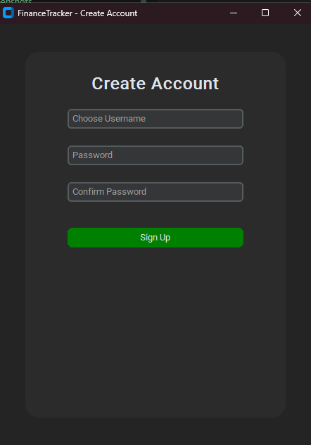
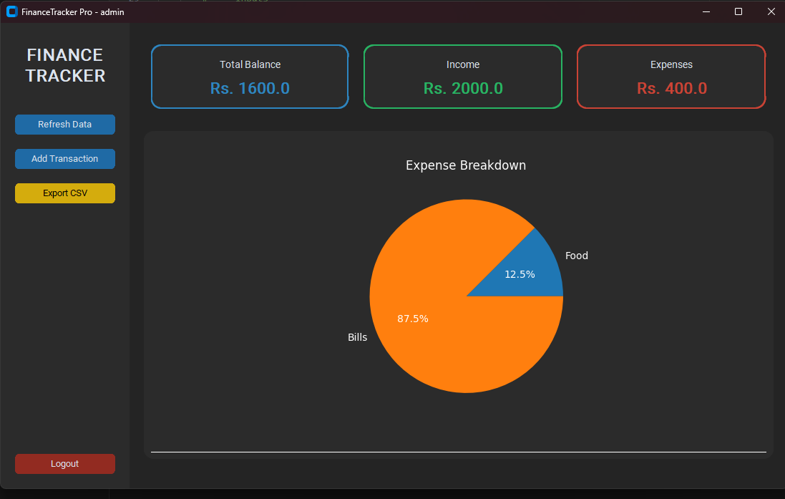
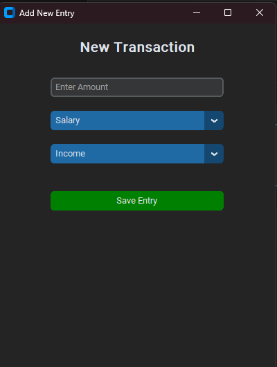
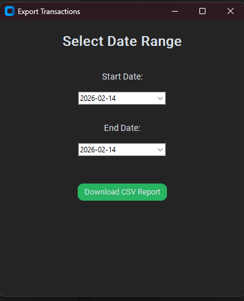

# FinanceTracker Pro 💹

FinanceTracker Pro is a high-performance, modern desktop application designed to help individuals manage their daily finances, track expenses, and visualize their spending habits. Built with Python and MySQL, it offers a secure and intuitive interface for personal wealth management.

## ✨ Key Features

* **Secure Authentication:** User registration and login system with password protection.
* **Dynamic Dashboard:** Real-time overview of Total Balance, Total Income, and Total Expenses.
* **Visual Analytics:** Interactive Pie Charts powered by Matplotlib to show expense breakdowns by category.
* **Transaction Management:** Quickly add income or expense entries with categorized tags.
* **Data Export:** Export your financial reports into **CSV format** based on custom date ranges.
* **Modern UI:** A sleek, dark-themed interface built using the `CustomTkinter` library.

## 🛠️ Tech Stack

* **Language:** Python 3.x
* **GUI Library:** CustomTkinter
* **Database:** MySQL
* **Data Processing:** Pandas
* **Visualization:** Matplotlib

## 🚀 Installation & Setup

Follow these steps to get the project running on your local machine:

### 1. Clone the Repository
```bash
git clone [https://github.com/yourusername/FinanceTrackerPro.git](https://github.com/yourusername/FinanceTrackerPro.git)
cd FinanceTrackerPro
2. Install Dependencies
Make sure you have pip installed, then run:

Bash
pip install -r requirements.txt
3. Database Configuration
Open your MySQL terminal and create the database:

SQL
CREATE DATABASE finance_db;
Update the credentials in the script (Host, User, Password) or set your environment variables:

DB_HOST

DB_USER

DB_PASSWORD

DB_NAME
```


4. Run the Application
```
python main.py
```

📸 Screenshots:
Login Page:


Signup Page:


Dashboard:


Adding New Transaction Window:


Saving Previous Records:



                Developed with ❤️ by Hassan
